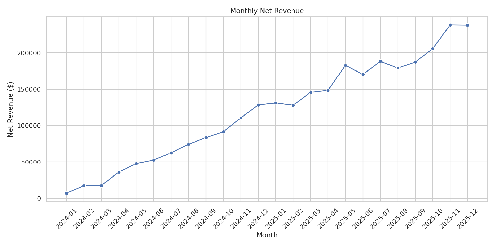
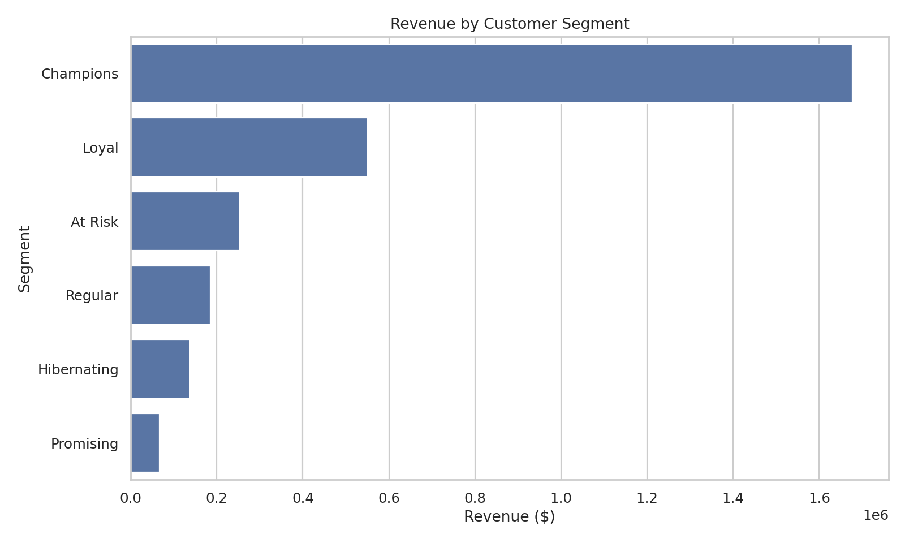
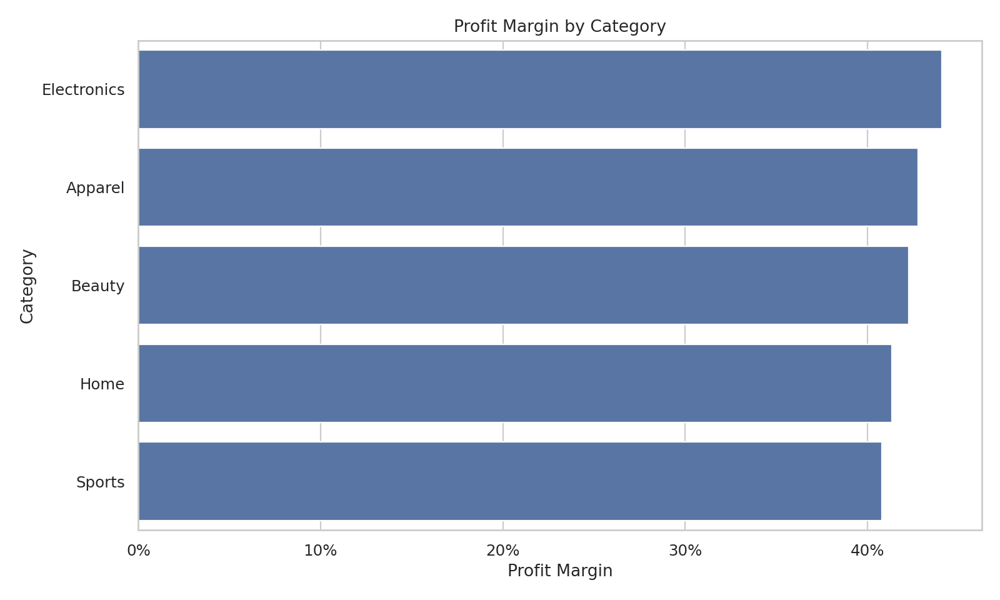

# Retail Revenue & Customer Analytics

An end-to-end data analytics project that turns raw retail transactions into commercial insights. The analysis focuses on revenue growth, profitability, customer value, retention, product performance, and acquisition-channel quality.

## Business Questions

- How are revenue, profit, order volume, and average order value changing over time?
- Which product categories create the strongest margins?
- Which customers are most valuable and which are at risk of churning?
- How well do customer cohorts retain after their first purchase?
- Which acquisition channels bring customers with the highest lifetime value?
- Which products generate the most profit after discounts and returns?

## Tech Stack

- Python: pandas, NumPy, Matplotlib, Seaborn
- SQL: CTEs, aggregation, customer-level analysis, KPI calculations
- Analytics: RFM segmentation, cohort retention, profitability analysis, growth metrics
- Data model: transaction-level retail dataset with customers, products, regions, channels, discounts, costs, and returns

## Project Structure

```text
retail-revenue-customer-analytics/
├── data/
│   ├── raw/
│   └── processed/
├── outputs/
├── sql/
│   └── analysis.sql
├── src/
│   ├── analyze.py
│   └── generate_data.py
├── run.py
└── requirements.txt
```

## Key Metrics

- Net revenue after discounts and returns
- Gross profit and profit margin
- Average order value
- Month-over-month revenue growth
- Active customers and order frequency
- Return rate
- Customer lifetime revenue
- Cohort retention

## Customer Segmentation

Customers are scored from 1 to 5 across recency, frequency, and monetary value. The resulting RFM model groups them into:

- Champions
- Loyal
- Promising
- At Risk
- Hibernating
- Regular

This makes the analysis actionable for retention campaigns, VIP treatment, reactivation offers, and channel optimization.

## Dashboard-Ready Outputs

The pipeline exports clean tables that can be imported directly into Power BI:

- `clean_transactions.csv`
- `monthly_summary.csv`
- `customer_segments.csv`
- `cohort_retention.csv`

## Visual Results

### Monthly Revenue



### Customer Segments



### Cohort Retention


### Category Profitability



## Run the Project

```bash
python -m venv .venv
pip install -r requirements.txt
python run.py
```

The project uses reproducible synthetic data, so it can be shared publicly without exposing confidential business information.

## Analyst Takeaways

The outputs support four practical decisions: which customer groups deserve retention budget, which acquisition channels create long-term value, where discounts reduce margin without enough revenue benefit, and which categories should receive more inventory and promotional attention.

